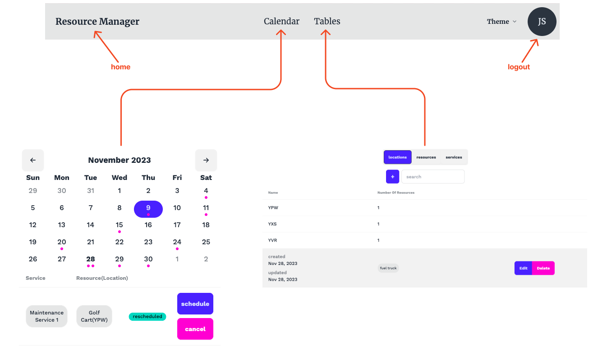
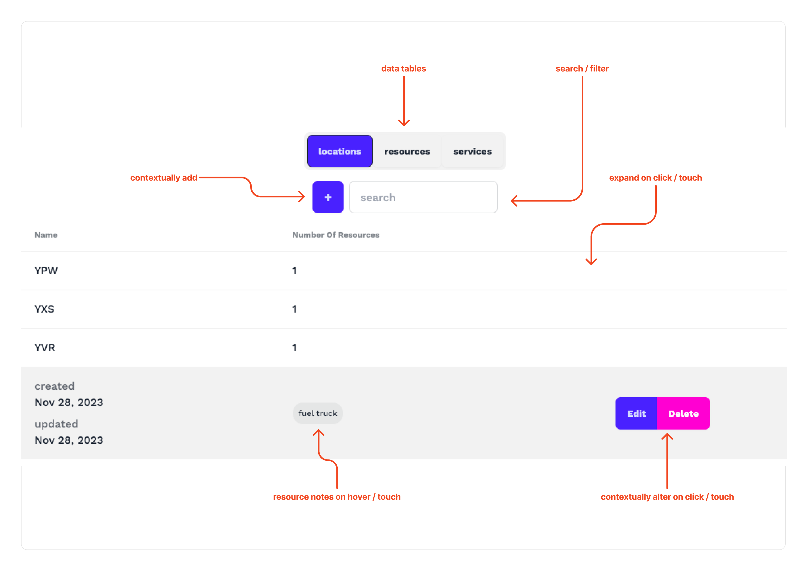
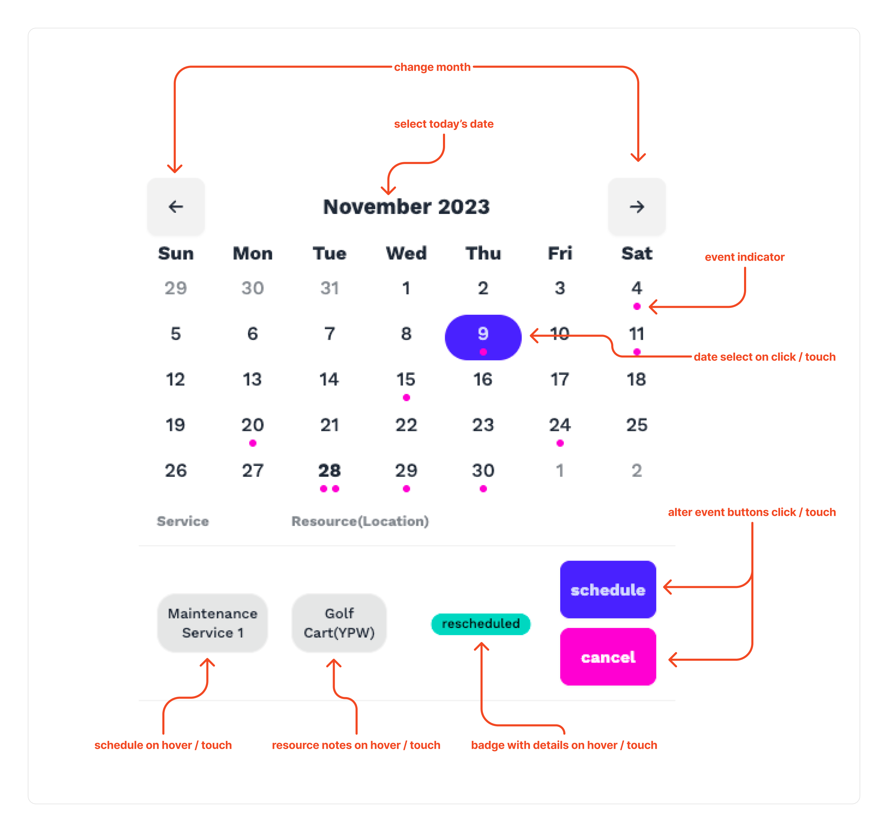
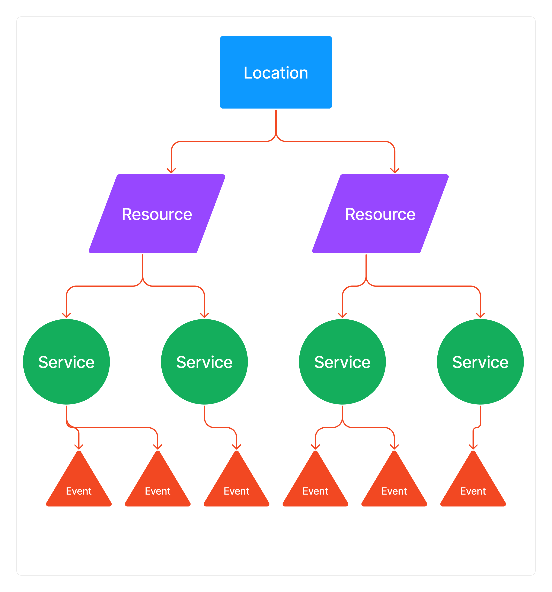
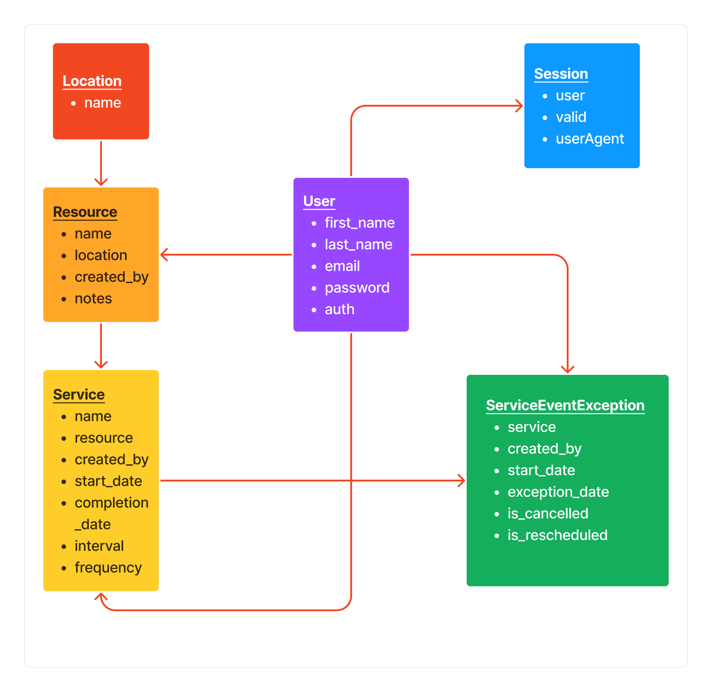

# Resource Manager App <!-- omit from toc -->

- [Introduction](#introduction)
  - [Resource Management](#resource-management)
  - [Location Assignment](#location-assignment)
  - [Service Attachment](#service-attachment)
  - [Scheduling and Event Creation](#scheduling-and-event-creation)
  - [Authentication and Authorization](#authentication-and-authorization)
- [Getting Started](#getting-started)
- [User Guide](#user-guide)
  - [User Creation](#user-creation)
  - [Adding Information](#adding-information)
  - [Overview](#overview)
  - [Tables](#tables)
  - [Calendar](#calendar)
- [Data Models](#data-models)
- [Project Overview](#project-overview)
- [Technologies Used](#technologies-used)
- [Configuration](#configuration)
- [Challenges and Solutions](#challenges-and-solutions)
- [Possible Future Enhancements](#possible-future-enhancements)
- [Conclusion](#conclusion)

## Introduction

Previously I held a position with an airline that operated equipment at various airports across Canada. A significant challenge the company encountered involved effectively overseeing the services provided for the equipment and maintaining a comprehensive record of all maintenance activities across their fleet.

This App is a resource management and scheduling tool that simplifies the process of keeping track of resources, their assigned locations, and the services that they require. The automated event creation system enhances the user experience by ensuring timely attention to maintenance tasks.

A break down of the functionality includes:

### Resource Management

The app allows users to manage various resources, such as trucks, equipment or any items that require maintenance or service.

### Location Assignment

Users can assign these resources to specific locations. This allows the resources to be tied to physical locations in the real world.

### Service Attachment

Each resource can be assigned with one or more service. These services represent tasks or maintenance activities that need to be performed on the resource.

### Scheduling and Event Creation

Based on the schedules, the app automatically generates events. These events serve as reminders or notifications to inform users that it’s time to perform a particular task or service on the resource.

### Authentication and Authorization

Depending on the role of the user, they will have different permissions as to read/write capabilities.

## Getting Started

!**link to hosting**!

To start a preview dev server:

1. fork from [this](https://github.com/LettsDev/service_portfolio) repository
2. Add .env [configuration file](#configuration)
3. open terminal in the /server directory
4. run the following commands

```terminal
npm run dev
```

Use Node.js version v20.6.1 or higher.

## User Guide

### User Creation

When creating a new user (register new user) you have 3 choices as to the authority level of the user (Admin, Enhanced, User). They will directly impact which functions are available. Below is a table outlining the minimum authority levels required for each function:

| Action                                       | Auth Level                             |
| -------------------------------------------- | -------------------------------------- |
| View any Information                         | User                                   |
| Location (add, edit, remove)                 | Admin                                  |
| Resource (add, edit, remove)                 | Enhanced (if creator, otherwise Admin) |
| Service (add, edit, remove)                  | Enhanced (if creator, otherwise Admin) |
| Service Event Exception (reschedule, cancel) | Enhanced (if creator, otherwise Admin) |

### Adding Information

In order to fully create an instance of a resource with a service attached:

1. create a location
2. create the resource and assign to the location on initialization
3. create services that can be attached to the resource

All this happens within the Tables section. The add, edit and delete buttons all lead to modal forms for data entry.

After a service has been created, events will be generated and displayed on the calendar. On selection of a day in the calendar which contains an event, more information will be displayed about the event. The user is able to reschedule or cancel the selected event.

### Overview



### Tables



### Calendar



## Data Models





## Project Overview

The app was designed to encompass many of the features that a production app would require. They include:

- authentication using JSON web tokens (cookie based auth)
- API routes which are locked based on user authority
- validation and sanitization of API requests
- CORS, helmet and other security practices
- a responsive UI that would be functional both on a phone and desktop

## Technologies Used

| Frontend        | Backend      | Both       |
| --------------- | ------------ | ---------- |
| ReactJS         | express      | TypeScript |
| Vite            | bcryptjs     | Zod        |
| vitest          | mongoose     | date-fns   |
| react-hook-form | morgan       |
| react-router    | lodash       |
| axios           | jsonwebtoken |
| TailwindCSS     |
| daisyUI         |
| react-icons     |              |            |

## Configuration

Within the server directory a `.env` file is required. It should contain the following variables:

```jsx
APIPORT;
NODE_ENV;
JWTSECRET;
SALT;
ORIGIN;
DOMAIN;
SECURE;
//Example values
APIPORT = 3000;
NODE_ENV = "developemnt";
JWTSECRET = "39131e02febaf758552edd591c9623c80022f44a096221b735b158c4c338f3d4";
SALT = 15;
ORIGIN = "http//localhost:3000";
DOMAIN = "localhost";
SECURE = "false";
```

There is some sample data in `server/tests/mock/mockData.ts` which can be modified accordingly. The dev server will load the mock data into memory using mongodb-memory-server.

## Challenges and Solutions

- Typescript isn’t fully supported by some of the modules used, and so some workarounds were necessary (using “as” to type variables)
- working with scheduling was tricky as there were many things to take account of (working with different time-zones, leap-years)
- not being able to use the full assortment of HTML time pickers (month, year) as they did not have satisfactory browser support
- being able to accommodate a dynamic set of inputs that worked with react-hook-form (schedule creation)

## Possible Future Enhancements

- attach notes to services and service exception events would provide more needed information. For example if a particular vendor was used for a service or the employee who completed the service event
- adding in a status field to resources to indicate their usability
- including geographical-coordinates to the location model in order to display a map of locations & resources
- admins having more control over the adding, editing and removal of users
- users can be assigned locations where additional authority parameters can be added. For example only users at a certain location can make changes to model data if at a certain authority level

## Conclusion

In conclusion, this application serves as an effective tool for managing resources and scheduling services in an organized manner. It offers a comprehensive solution for keeping track of resources, assigning them to physical locations, and scheduling maintenance tasks.
